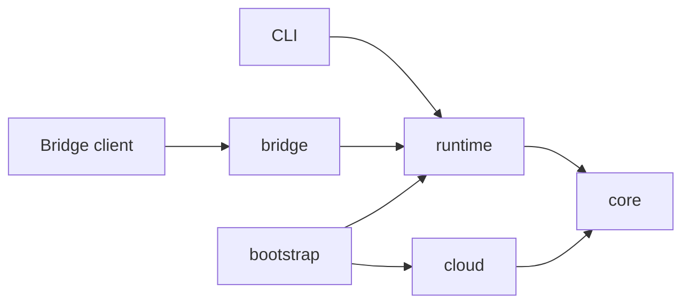

# Architecture

Aeloon is one Python distribution with four modules and a small composition root:

`core` never imports `runtime`, `bridge`, or `cloud`. `runtime` never imports `bridge` or `cloud`;
remote providers and account operations are injected by `bootstrap`.

## Core: one stateless run

`aeloon_core.core.run_agent()` receives a complete `RunRequest` and returns a `RunResult`. It owns
only invocation-local state: the provider/tool loop, retries, streaming events, hooks, temporary
messages, steering/follow-up queues, and cancellation. A `RunController` is bound for one call and
becomes inactive when that call settles.

Core detects context thresholds and provider overflow errors. It asks an injected
`ContextCompactor` for a replacement message sequence without accessing a Session or repository.
Stateless summary generation and token estimation also live in core.

## Runtime: sessions and context

`RuntimeService` is the application boundary. It owns the append-only JSONL v3 Session tree,
context restoration, resources, persisted next-turn input, branch navigation, provider catalog,
settings, per-session serialization, cross-session concurrency, and operation lifecycle.

For a turn, runtime builds a `RunRequest`, injects a Session-backed context compactor, and persists
each completed core message immediately. Provider and tool resources are closed by runtime after
the operation. Runtime emits typed `RuntimeEvent` values and does not know RPC methods or
`BridgeError`.

Runtime-owned workflow tools may be composed into a `RunRequest` through core's generic
`AgentTool` contract. The intrinsic `present_files` tool follows this path: runtime validates final
deliverables, records `artifact_delivery` entries outside model context, and projects optional
artifact metadata into operation blocks. Core has no office-format or presentation dependency.

## Bridge: channels and wire contracts

`BridgeRpcAdapter` maps Bridge v2 JSON-RPC methods and errors to typed runtime calls. It owns public
event sequence numbers, the 5,000-event replay buffer, server instance identity, handshake data,
wire DTO serialization, and attachment-root validation. `BridgeDaemon` only owns Unix socket,
NDJSON connection, lifecycle, and broadcast behavior.

Bridge v2 method names, events, schema, error codes, and replay behavior remain stable.

## Cloud: optional remote capabilities

Cloud owns account login, token refresh and vault storage, model discovery, the HTTP client, and
the cloud Provider implementation. It depends only on provider-neutral core contracts. The
composition root adapts these capabilities into runtime's account and remote-provider ports.

## Sessions and compaction

Sessions remain append-only version-3 JSONL trees with immutable headers. Messages are flushed and
fsynced as soon as core completes them. Runtime selects the compaction cut point and persists the
summary; core supplies the stateless summarization call and coordinates overflow retry within the
active run.
