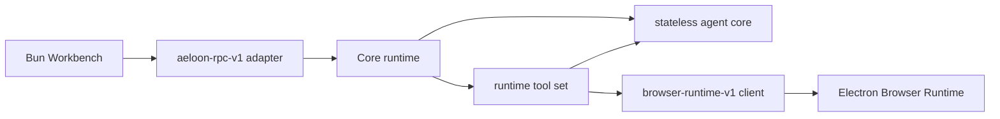

# Architecture

Aeloon Core is one Python distribution with inward-only dependencies. Electron and UI code are
not dependencies of this repository.

The fixed dependency directions are `rpc → runtime → core`, `runtime → tool/core/browser`, and
`tool → core`. Bootstrap is the composition root. Core never imports Electron, Bun, React, UI,
`httpx`, Pillow, or a concrete vendor implementation.

## Core: one stateless inference run

`aeloon_core.core.run_agent()` receives a complete `RunRequest` and returns a `RunResult`.
`RunRequest.inference` is an `InferencePort`; tools implement the neutral `Tool` protocol. Core
owns only invocation-local engine, controller, queues, cancellation tasks, messages, and tool-loop
state. Nothing is retained after the await completes.

Core contains model identity and general capability metadata, streaming inference contracts,
events, token estimation, and the `ContextCompactor` port. It coordinates threshold and overflow
compaction but has no Session selection, summarization prompt, transport, authentication, model
discovery, or vendor compatibility logic.

## Tool: object-oriented built-ins

`aeloon_core.tool` contains `BaseTool`, `ToolContext`, filesystem tools, `BashTool`, search tools,
and `BuiltinToolSet`. A ToolSet shares one context-scoped mutation-lock map; there is no process
global write registry. Writes and edits replace their target atomically.

Runtime's `RuntimeToolSet` explicitly adds `PresentFilesTool`. This composition is intentionally
small and does not introduce a plugin registry.

## Runtime: state and first-class Browser Use

Runtime owns Sessions, Skills, prompt templates, prompt construction, artifacts, compaction
selection and persistence, Provider configuration, and all resource lifecycles. `SessionAgent`
uses one operation-scoped `ProviderManager`, so the main run, compaction, branch summary, and
automatic title reuse one inference instance. Closing the agent closes the whole manager.

`ProviderManager` constructs Providers lazily from a fixed driver factory mapping. It resolves
qualified and unqualified model IDs, isolates transient model-discovery failures by Provider, and
closes every instantiated Provider idempotently. Catalog and settings operations use short-lived
managers and always close them in `finally` blocks.

Bootstrap also gives each Manager a lazy Cloud account gateway bound to the same configuration
snapshot. Updating settings can therefore replace the service-level account client without
mutating an operation that is already running.

Concrete implementations live in `aeloon_core.runtime.providers`: Custom OpenAI-compatible APIs,
DeepSeek, Aeloon Cloud, and the testing-only `ScriptedProvider`.

Browser Use is a fixed runtime feature, not a plugin. Core owns the 22 tool definitions, schemas,
workspace upload checks, scheduling, cancellation, result envelopes, and multimodal image
observations. When a Browser Runtime endpoint is configured at process startup, these tools are
always in the model catalog and cannot be removed by persistent tool preferences. Electron owns
only the actual browser and CDP execution behind `browser-runtime-v1`. A disconnected endpoint
returns the stable `BrowserRuntimeUnavailable` error; it does not remove the tools or fall back to
shell networking.

The UI thread UUID is used unchanged as both the Core Session ID and Browser scope ID. This keeps
affinity explicit and removes transport-specific identity mappings.

## Local RPC and Cloud

`aeloon-rpc-v1` is a small private transport adapter over Runtime. It uses length-prefixed JSON on
a restricted Unix socket and owns dispatch, cancellation, frame limits, timeouts, event delivery,
and JSON DTOs. It has no legacy negotiation, token, certificate, capability grant, or background
discovery. The adapter does not import UI or Electron code.

Cloud owns login, refresh tokens, the vault, and raw model-catalog access. It does not create Core
models or inference implementations. Bootstrap adapts `CloudAccountService` to `AccountGateway`
and injects it into Runtime's Provider manager factory.

Sessions remain append-only JSONL. Socket paths, Browser operation IDs, and transport state are
operation-local and are never serialized into Session data.
