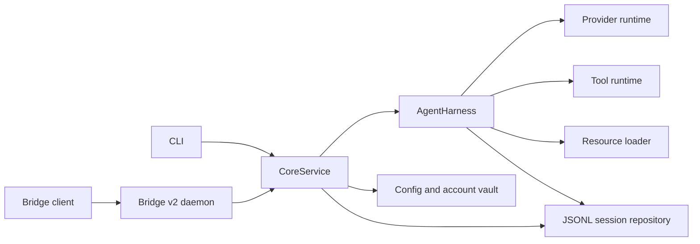

# Architecture

Aeloon Core separates user-facing commands and transport concerns from the harness runtime,
provider integrations, and durable session state.

## Application boundary

`CoreService` is the boundary between CLI or Bridge clients and the private harness, session, and
configuration layers. It owns provider discovery, model selection, session lookup, operation
serialization, and the DTOs exposed to external clients.

The CLI uses the same service operations as other clients. Bridge transport code handles daemon
lifecycle, socket communication, validation, and event replay without exposing internal Python
types.

## Providers and models

The provider registry merges account-backed cloud models and user-added OpenAI-compatible local
endpoints into one catalog. Every model has a stable `provider/model` identifier. Provider-local
names are resolved in catalog order, while full identifiers provide explicit disambiguation.

Core owns cloud account refresh state and the local credential vault. Public account and provider
DTOs are redacted before they cross the service boundary.

## Harness lifecycle

`AgentHarness` uses the phases `idle`, `turn`, `compaction`, `branch_summary`, and `retry`. A normal
prompt is rejected while another phase is active.

During a turn:

1. resources are reloaded and the effective prompt is assembled;
2. the provider streams an assistant response;
3. complete tool calls are dispatched and their results are returned to the provider;
4. a response without tool calls ends the turn naturally;
5. completed messages and run boundaries are persisted.

`steer()` adds input after the current tool batch, `follow_up()` continues after natural
completion, and `next_turn()` queues input for the next explicit prompt. Queue modes can process
one item at a time or all pending items together.

## Tool runtime

The default tools are `read`, `bash`, `edit`, and `write`; `grep`, `find`, and `ls` can be enabled
as additional tools. Calls execute concurrently by default. Mutations to the same file are
serialized, and results are returned in call order.

A length-limited response that still contains tool calls is not executed because its arguments
may be incomplete. Tool errors are returned to the provider so the turn can recover or finish with
a useful diagnostic.

## Resources and prompts

`ResourceLoader` combines global resources from `~/.aeloon-core`, workspace resources from
`<workspace>/.aeloon-core`, and recognized project instruction files. Workspace resources override
same-named global resources.

The effective prompt is assembled in deterministic order from the base prompt, appended system
content, project instructions, skills, and the current working directory. Resources are reloaded
at every turn boundary.

## Sessions and compaction

Sessions are version-3 append-only JSONL trees with an immutable header. Entries record messages,
model and tool changes, compactions, branch summaries, labels, navigation, and Bridge run
boundaries. Each completed message is flushed and fsynced immediately.

Tree navigation can return to an earlier entry and optionally summarize the abandoned branch.
Automatic semantic compaction keeps a recent turn-safe tail and summarizes older context. The
summary preserves goals, decisions, progress, paths, errors, and file-operation history, and can
merge an earlier summary.

Session snapshots expose lifetime token and cost totals alongside effective-branch context
statistics. Context statistics report window occupancy, estimated token share for system, user,
assistant, and tool-result messages, plus cache token and request hit rates. Provider-reported
usage is preferred for the current context total; messages after the last response use the same
estimator as automatic compaction.

## Bridge v2

Bridge v2 uses JSON-RPC 2.0 over NDJSON on a Unix domain socket. The runtime directory is mode
`0700`; socket and daemon metadata are mode `0600`. Startup is concurrency-safe, and conflicting
configuration never terminates an existing daemon.

The daemon serializes operations within each session and limits cross-session concurrency. It
retains 5,000 ordered public events for cursor replay. Client disconnects do not cancel active
work; clients reconcile through `session.get` after an instance change or replay gap.

Attachments are validated against roots declared during the handshake and copied into
Core-managed per-session storage before an operation is queued. The protocol schema is stored in
[`aeloon_core/bridge/bridge-protocol-v2.json`](../aeloon_core/bridge/bridge-protocol-v2.json).
